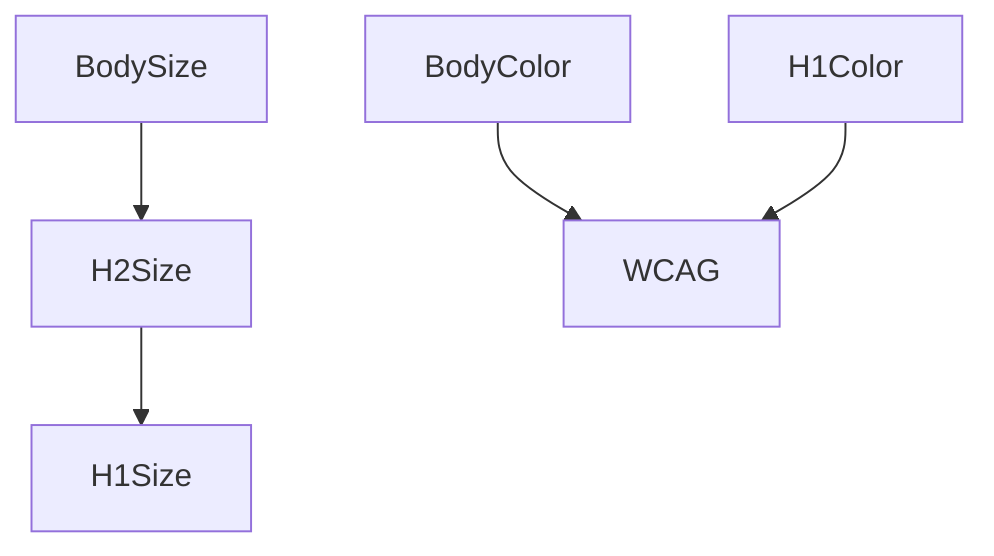

# Design Constraint Validator (DCV)
> Mathematical constraint validator for design systems — ensuring consistency, accessibility, and logical coherence.

[](https://github.com/CseperkePapp/design-constraint-validator/actions/workflows/ci.yml)
[](LICENSE)
[](#)

> **Note:** DCV's CI intentionally includes validation errors in example tokens to demonstrate the tool works. See our [CI workflow](.github/workflows/ci.yml) for how we use `--fail-on off` to report violations without blocking builds.

**Design Constraint Validator (DCV)** validates design constraints across token sets and styles:
- ✅ **Accessibility:** WCAG text contrast, perceptual lightness floor/ceilings
- ✅ **Order & Monotonicity:** increasing typography scales, spacing hierarchies
- ✅ **Thresholds & Policies:** min/max ranges, cross-axis guards (size × weight × contrast)
- ✅ **Graph Intelligence:** Hasse/poset graph export; "why" explanations with implicated edges

This is **not** a schema linter; it's a **reasoning validator** for values and relationships.

---

## Installation

```bash
# Local (recommended)
npm i -D design-constraint-validator

# One-off run
npx dcv --help
```

**Node:** ≥ 18.x (ESM)

---

## Quick Start

```bash
# Validate a token set (JSON) with default constraints
npx dcv validate ./tokens/example.tokens.json

# Validate with a policy profile (e.g., AA)
npx dcv validate ./tokens/example.tokens.json --policy ./themes/policies/aa.json

# Explain failures (tabular)
npx dcv why --format table

# Export graph (Mermaid or DOT)
npx dcv graph --format mermaid > graph.mmd
```

> Try the failing samples to see diagnostics:

Note: When installed from npm, the `examples/` folder is not included to keep the package lean. You can browse and run examples directly from the repo:

- Failing examples: https://github.com/CseperkePapp/design-constraint-validator/tree/main/examples/failing
- Minimal example: https://github.com/CseperkePapp/design-constraint-validator/tree/main/examples/minimal

```bash
npx dcv validate ./examples/failing/contrast-fail.tokens.json
npx dcv validate ./examples/failing/monotonicity-fail.tokens.json
```

---

## Input formats

DCV accepts a **token JSON** (flat or nested) and optional **policy JSON**.
Adapters normalize common ecosystems (Style Dictionary, Tokens Studio JSON, DTCG).

* See: [`adapters/README.md`](adapters/README.md)
* Example policies: `themes/policies/*.json` (AA/AAA presets, org policies)

---

## Example Output (Why / Explanations)

```
Constraint                    Status   Details
────────────────────────────  ──────   ─────────────────────────────────────────────
WCAG Contrast ≥ 4.5:1        FAIL     text.primary(#5A5A5A) on bg.body(#F5F5F5) ⇒ 3.8
Typography monotonic scale   FAIL     h3(22) < body(18) < h2(21) < h1(34)  ✖ out-of-order: h2<h3
Cross-axis (weight vs size)  PASS     all headings satisfy min weight for size bucket
Perceptual L (OKLCH L)       PASS     text on dark surfaces ≥ 0.85 L
Exit code: 1 (violations found)
```

---

## Programmatic API (Node)

```ts
// ESM / TypeScript
import { validate } from 'design-constraint-validator';

const result = await validate({
  tokensPath: './tokens/example.tokens.json',
  policyPath: './themes/policies/aa.json'
});

if (result.ok) {
  console.log('All constraints satisfied.');
} else {
  for (const v of result.violations) {
    console.log(`[${v.kind}] ${v.message}`, v.context);
  }
  process.exitCode = 1;
}
```

### Quick try (REPL)

```bash
node
```

```js
// In Node REPL (ESM)
const dcv = await import('design-constraint-validator');
const tokens = { typography: { size: { h1: { $value: '32px' }, h2: { $value: '24px' } } } };
const themes = { order: [["typography.size.h1", ">=", "typography.size.h2"]] };
const res = await dcv.validate({ tokensObject: tokens, policyObject: themes });
console.log(res.ok ? 'OK' : res.violations);
```

### Subpath imports (typed)

If you prefer lower-level primitives:

```ts
import { flattenTokens } from 'design-constraint-validator/core/flatten.js';
import { Engine } from 'design-constraint-validator/core/index.js';
```

**Return shape (simplified):**

```ts
type ValidationResult = {
  ok: boolean;
  violations: Array<{
    kind: 'wcag' | 'monotonic' | 'threshold' | 'crossAxis' | string;
    message: string;
    context?: Record<string, unknown>;
    nodes?: string[];      // implicated token ids
    edges?: [string,string][]; // graph edges
  }>;
  stats: { checked: number; durationMs: number };
};
```

---

## Why constraints, not conventions?

Conventional linters catch **schema** issues ("has a value, has a type").
**DCV** enforces **relationships** that matter to users and brand integrity:

* Legible contrast under all themes and states
* Proper hierarchical spacing/typography (monotonic scales)
* Coherent cross-axis behavior (e.g., weight increases with size where needed)
* Policy conformance (AA/AAA, internal thresholds)

This transforms tokens from "bags of numbers" into a **formal design system**.

---

## Comparison (schema linters vs DCV)

* **Schema linters** (e.g., DTCG schema validators) ensure JSON shape.
* **DCV** validates **mathematical & policy constraints** over *values and relations*.

> DCV is not affiliated with Anima's `design-tokens-validator` (schema-focused).

---

## Graphs

Export the constraint graph for audits and docs:

```bash
npx dcv graph --format mermaid > graph.mmd
```

**Mermaid (illustrative):**



---

## Adapters

* **Style Dictionary** input
* **Tokens Studio JSON** input
* **DTCG** (Design Tokens Community Group) mapping

See [`adapters/README.md`](adapters/README.md) for format notes.

---

## Getting Started

### Your First Validation (5 minutes)

**1. Install**
```bash
npm install -D design-constraint-validator
```

**2. Create `tokens.json`** in your project root:
```json
{
  "color": {
    "text": { "$value": "#1a1a1a" },
    "background": { "$value": "#ffffff" }
  },
  "typography": {
    "size": {
      "h1": { "$value": "32px" },
      "h2": { "$value": "24px" },
      "body": { "$value": "16px" }
    }
  }
}
```

**3. Create `themes/wcag.json`** (WCAG contrast constraint):
```json
{
  "constraints": {
    "wcag": [{
      "foreground": "color.text",
      "background": "color.background",
      "ratio": 4.5
    }]
  }
}
```

**4. Create `themes/typography.order.json`** (size hierarchy):
```json
{
  "order": [
    ["typography.size.h1", ">=", "typography.size.h2"],
    ["typography.size.h2", ">=", "typography.size.body"]
  ]
}
```

**5. Validate**
```bash
npx dcv validate
```

**Output:**
```
✅ validate: 0 error(s), 0 warning(s)
```

Success! Your tokens pass all constraints.

### What if validation fails?

Try changing `h2` to `"40px"` (larger than h1) and run validation again:

```bash
npx dcv validate
```

**Output:**
```
validate: 1 error(s), 0 warning(s)
ERROR monotonic  typography.size.h2 @ typography.order.json — typography.size.h1 >= typography.size.h2 violated: 32px < 40px
```

The validator explains exactly what failed and why.

### Minimal Working Example

See [examples/minimal/](examples/minimal/) for a complete minimal setup you can copy.

## Example Output

### ✅ Successful Validation
```bash
$ npx dcv validate
✅ validate: 0 error(s), 0 warning(s)
```

### ❌ Failed Validation
```bash
$ npx dcv validate
validate: 2 error(s), 1 warning(s)

ERROR monotonic  typography.size.h2
  typography.size.h1 >= typography.size.h2 violated: 32px < 40px
  Defined in: themes/typography.order.json

ERROR wcag  color.text vs color.background
  Contrast ratio 4.5:1 required, got 2.1:1
  Defined in: themes/wcag.json

WARN threshold  control.size.min
  Touch target should be >= 44px, got 30px
  Defined in: themes/touch.json
```

## Constraint Types

### 1. Monotonic Constraints
Enforce ordering relationships (e.g., h1 ≥ h2 ≥ h3)

```json
{
  "order": [
    ["typography.size.h1", ">=", "typography.size.h2"],
    ["typography.size.h2", ">=", "typography.size.h3"]
  ]
}
```

### 2. WCAG Contrast
Validate color accessibility

```json
{
  "constraints": {
    "wcag": [
      {
        "foreground": "color.role.text.default",
        "background": "color.role.bg.surface",
        "ratio": 4.5
      }
    ]
  }
}
```

### 3. Threshold Rules
Size guardrails (e.g., ≥44px touch targets)

```typescript
{
  id: 'control.size.min',
  op: '>=',
  valuePx: 44,
  where: 'Touch target (WCAG / Apple HIG)'
}
```

### 4. Lightness Ordering
Color palette progression

```json
{
  "order": [
    ["color.palette.brand.100", ">=", "color.palette.brand.200"],
    ["color.palette.brand.200", ">=", "color.palette.brand.300"]
  ]
}
```

### 5. Cross-Axis Constraints
Multi-domain relationships

```json
{
  "when": { "id": "typography.weight.body", "op": "<=", "value": 400 },
  "require": { "id": "typography.size.body", "op": ">=", "fallback": "16px" }
}
```

## CLI Commands

### Validate

```bash
# Validate all tokens
dcv validate

# Validate specific breakpoint
dcv validate --breakpoint md

# All breakpoints with summary
dcv validate --all-breakpoints --summary table

# Fail on warnings
dcv validate --fail-on warn
```

### Graph Visualization

Export token dependency graphs in text formats (Mermaid, Graphviz DOT):

```bash
# Export Mermaid format (renders on GitHub)
dcv graph --hasse typography --format mermaid > typography.mmd

# Export Graphviz DOT format
dcv graph --hasse color --format dot > color.dot

# JSON format for programmatic use
dcv graph --hasse layout --format json > layout.json

# Show only violations
dcv graph --hasse color --only-violations --format mermaid

# Highlight violations
dcv graph --hasse layout --highlight-violations --format mermaid
```

**Rendering Options:**
1. **GitHub** - Paste Mermaid code into `.md` files (native support)
2. **mermaid.live** - Online Mermaid editor and renderer
3. **VS Code** - Use Mermaid Preview extension
4. **Graphviz** - Render DOT files: `dot -Tpng color.dot -o color.png`

**For PNG/SVG generation** (optional):
```bash
# Install Mermaid CLI globally
npm install -g @mermaid-js/mermaid-cli

# Generate image
mmdc -i typography.mmd -o typography.png
```

### Provenance Analysis

```bash
# Why does this token have this value?
dcv why typography.size.h1

# JSON output
dcv why color.role.text.default --format json
```

### Build Tokens

```bash
# Build tokens
dcv build

# Build all formats
dcv build --all-formats

# Watch mode
dcv build --watch
```

### Set Token Values

```bash
# Set a single token
dcv set typography.size.h1=32px

# Set color with OKLCH
dcv set color.palette.brand.500=oklch(0.65 0.15 280)
```

## Use Cases

✅ **Design System Validation** - Catch inconsistencies in CI/CD
✅ **Accessibility Compliance** - Ensure WCAG 2.1 AA/AAA
✅ **Multi-Breakpoint** - Validate responsive token overrides
✅ **Dependency Analysis** - Visualize token relationships
✅ **Token Debugging** - Understand where values come from

## Example

**tokens.json:**
```json
{
  "typography": {
    "size": {
      "h1": "32px",
      "h2": "24px",
      "body": "16px"
    }
  },
  "color": {
    "role": {
      "text": { "default": "#1a1a1a" },
      "bg": { "surface": "#ffffff" }
    }
  }
}
```

**themes/typography.order.json:**
```json
{
  "order": [
    ["typography.size.h1", ">=", "typography.size.h2"],
    ["typography.size.h2", ">=", "typography.size.body"]
  ]
}
```

**Validate:**
```bash
$ npx dcv validate

✅ validate [bp=base]: 0 error(s), 0 warning(s)
```

## Architecture

```
┌─────────────────────────────────────┐
│     Token Dependency Graph (DAG)    │
│   Tracks references & dependencies  │
└─────────────────────────────────────┘
                 ↓
┌─────────────────────────────────────┐
│      Constraint Validation Engine   │
│  ┌──────────────────────────────┐  │
│  │  Plugin-based architecture   │  │
│  │  - Monotonic                 │  │
│  │  - WCAG Contrast             │  │
│  │  - Threshold                 │  │
│  │  - Lightness                 │  │
│  │  - Cross-Axis                │  │
│  └──────────────────────────────┘  │
└─────────────────────────────────────┘
                 ↓
┌─────────────────────────────────────┐
│        Violation Reporting          │
│  - Descriptive error messages       │
│  - Provenance tracing               │
│  - Graph visualization              │
└─────────────────────────────────────┘
```

## Documentation

- **[Getting Started](docs/Getting-Started.md)** - 5-minute quick start
- **[Constraint Types](docs/Constraints.md)** - All constraint types
- **[CLI Reference](docs/CLI.md)** - Complete command documentation
- **[Configuration](docs/Configuration.md)** - Config file options
- **[Architecture](docs/Architecture.md)** - How DCV works
- **[API Reference](docs/API.md)** - Programmatic usage

---

## Roadmap

* Plugin API for **custom constraints**
* **VS Code** diagnostics (inline explain)
* **Cross-axis packs** (typography × weight × contrast)
* **Receipts & provenance** (hashes, signable reports)
* UI graph explorer (node inspector, violations focus)

---

## Philosophy

> **Constraints, not conventions.**

Design systems need more than naming conventions - they need mathematical guarantees. This validator:

1. **Enforces relationships** - Typography hierarchies, color progressions
2. **Validates accessibility** - WCAG contrast with alpha compositing
3. **Explains violations** - Provenance tracing shows why rules fail
4. **Scales with complexity** - Incremental validation of 1000s of tokens

## Related Projects

This is the **core validation engine**. For a complete decision-driven design system with a 5-axis framework (Tone, Emphasis, Size, Density, Shape) and theme configurator UI, see **DecisionThemes** (coming soon).

## FAQ

### How does the tool find my tokens and constraints?

By default, it looks for:
- **Tokens**: `tokens.json` or `tokens/*.json`
- **Constraints**: `themes/*.json` or `themes/**/*.json`

You can customize paths in a `dcv.config.json` file. See [CONFIGURATION.md](CONFIGURATION.md) for details.

### What's the relationship with DecisionThemes?

`design-constraint-validator` is the **core validation engine** - it validates any design tokens against constraints.

**DecisionThemes** (coming soon) is a complete design system framework that uses this validator under the hood, plus adds:
- 5-axis decision framework (Tone, Emphasis, Size, Density, Shape)
- Theme configurator UI
- Decision → Token mapping

Think of it as: **design-token-validator** = engine, **DecisionThemes** = full product built on the engine.

### Can I use this with my existing tokens?

Yes! As long as your tokens follow a structured JSON format. The tool supports:
- [W3C Design Tokens Community Group](https://design-tokens.github.io/community-group/) format
- Custom nested JSON structures
- Token references with `{token.path}` syntax

### How do I use incremental validation?

Incremental validation automatically detects changed tokens and only validates those tokens plus their dependents. This feature is built-in - no configuration needed. When you run `dcv validate`, it will use cached results for unchanged tokens.

### What breakpoints are supported?

The tool supports responsive tokens with breakpoint-specific overrides. Place override files in `tokens/overrides/`:
- `tokens/overrides/sm.json` - Small screens
- `tokens/overrides/md.json` - Medium screens
- `tokens/overrides/lg.json` - Large screens

Validate specific breakpoints with `--breakpoint md` or all breakpoints with `--all-breakpoints`.

### Can I use this in CI/CD?

Absolutely! That's a primary use case:

```yaml
# .github/workflows/validate-tokens.yml
name: Validate Design Tokens
on: [push, pull_request]
jobs:
  validate:
    runs-on: ubuntu-latest
    steps:
      - uses: actions/checkout@v4
      - uses: actions/setup-node@v4
      - run: npm ci
      - run: npx dcv validate --fail-on warn
```

The tool exits with non-zero code on validation failures, making it perfect for CI/CD gates.

### How do I visualize my token dependencies?

Use the `graph` command:

```bash
# Generate Mermaid diagram (renders on GitHub)
dcv graph --hasse typography --format mermaid > typography.mmd

# Generate Graphviz DOT
dcv graph --hasse color --format dot > color.dot

# Then render with Graphviz
dot -Tpng color.dot -o color.png
```

### What Node.js version do I need?

Node.js 18 or higher is required.

## Contributing

Contributions welcome! See [CONTRIBUTING.md](CONTRIBUTING.md)

## License

MIT © Cseperke Papp
