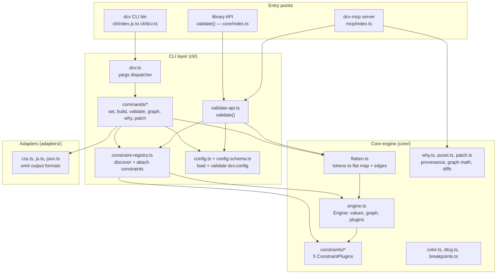
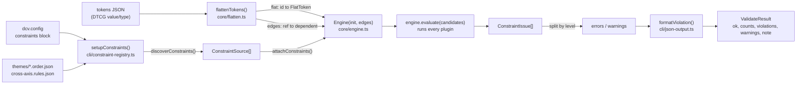
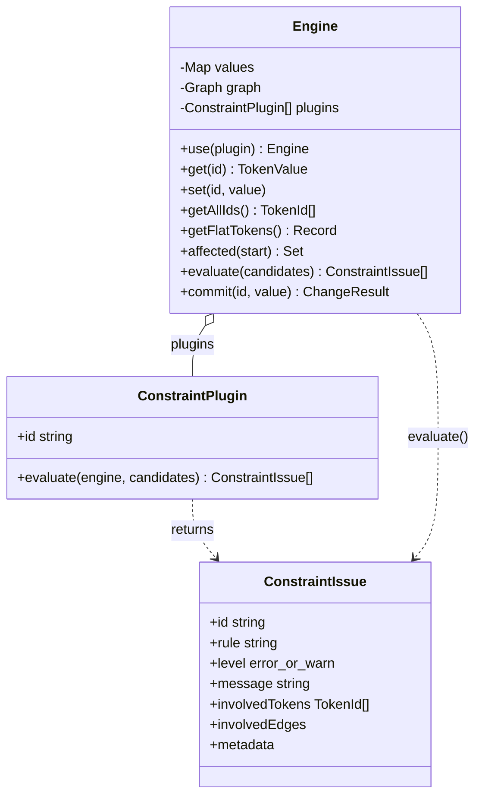
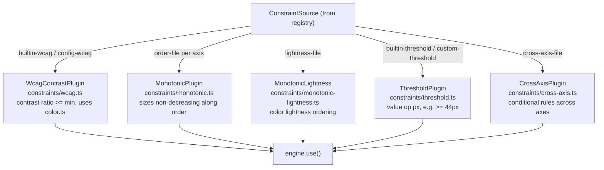
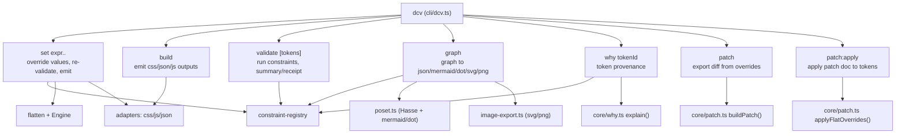

# Architecture & Diagrams — design-constraint-validator

A map of how this codebase is actually wired, derived from the source under `core/`, `cli/`, `adapters/`, and `mcp/`. (The `.ts` files are the source of truth; the sibling `.js`/`.d.ts` are TypeScript build output.)

## What it does, in one paragraph

It is a mathematical constraint validator for design systems. You give it a set of design **tokens** (DTCG-style JSON — colors, sizes, spacing) and a set of **constraints** (WCAG contrast minimums, monotonic ordering, pixel thresholds, cross-axis rules). It flattens the tokens into a flat map plus a dependency graph of `{references}`, loads the constraints that apply, runs each constraint as a plugin over the relevant tokens, and reports violations. The same engine is exposed three ways: a `dcv` CLI, a `validate()` library function, and an MCP server (`dcv-mcp`) so an LLM can call it as a tool.

## Three entry points, one engine

The whole point of the layering is that all three surfaces funnel into the same core. The CLI and MCP server are thin; the real work lives in `core/` and the constraint registry.

The MCP server is deliberately the thinnest: `mcp/tools.ts` imports `validate` from `cli/validate-api.ts` and `explain` from `core/why.ts` directly, so the `validate` and `why` MCP tools are the exact same code paths as the library and CLI. It exposes **six read-only tools**: `validate`, `why`, `graph`, plus three derivation tools — `list-constraints`, `explain`, `suggest-fix` (`mcp/insights.ts`) — that reuse the constraint registry and `core/color` math to turn violations into verified suggestions without writing anything.

## The validation pipeline

This is the spine of the system — the path taken by `validate()` (and, with extra CLI plumbing, by `dcv validate`). Every box is a real function call.

Key details the diagram compresses:

`flattenTokens` does two passes. The first walks the nested token tree, records each `$value`, normalizes DTCG structured color/dimension objects (`core/dtcg.ts`), and records a graph **edge** for every `{token.reference}` it finds. The second pass resolves those references to a fixpoint and throws if anything is left unresolved (a genuine cycle). It also fails closed on a non-object root, so malformed input can't silently "pass."

`setupConstraints` is the single source of truth for *which* constraints are active. `discoverConstraints` scans the config block (`enableBuiltInWcagDefaults`, `enableBuiltInThreshold`, custom `wcag`/`thresholds` arrays) and the filesystem (`themes/<axis>.order.json`, `color.order.json`, `cross-axis.rules.json`, plus `.<breakpoint>` variants) and returns a typed `ConstraintSource[]`. `attachConstraints` then maps each source to a plugin and registers it on the engine via `engine.use(...)`.

The `note` field exists to catch a subtle failure mode: a token file that validates with zero errors only because no active constraint references any of its tokens. `collectReferencedIds` enumerates which token IDs the active constraints actually touch and flags the "nothing was checked" case.

## The Engine and the plugin contract

`Engine` is small and deliberately dumb. It holds a `values` map, a `graph` (`id` to `Set<dependents>`), and a list of plugins. It does not know what any constraint *means*.

Two contract rules every plugin honors. **Candidate set:** `evaluate(engine, candidates)` only checks constraints involving at least one candidate token — this makes incremental re-validation cheap. When a single token changes, `commit()` computes `affected()` (everything downstream in the dependency graph) and evaluates only that set. **Metadata:** plugins populate `involvedTokens` (and sometimes `involvedEdges`) so downstream tooling can highlight, filter, and draw graphs.

There are exactly five plugins, each a factory function returning a `ConstraintPlugin`:

`WcagContrastPlugin` is the one that reaches into `core/color.ts` for the real math — sRGB-to-linear luminance, contrast ratio, and alpha compositing (`compositeOver`) so contrast can be computed against a backdrop for semi-transparent colors.

## The CLI command map

`cli/dcv.ts` is a yargs dispatcher (with camelCase expansion intentionally off). Each subcommand lives in `cli/commands/` and pulls only what it needs from core.

`graph` is the most feature-rich command: it builds the dependency digraph, optionally reduces it to a Hasse diagram (`poset.ts` — transitive reduction), filters/focuses by prefix or k-hop neighborhood, can highlight violations, and exports to JSON, Mermaid, DOT, or rendered SVG/PNG via `core/image-export.ts`.

## Directory reference

| Path | Role |
|------|------|
| `core/engine.ts` | The `Engine` — values, dependency graph, plugin host, incremental `commit()` |
| `core/flatten.ts` | Tokens to flat map + reference edges; DTCG normalization; cycle detection |
| `core/constraints/` | The 5 constraint plugins (wcag, monotonic, monotonic-lightness, threshold, cross-axis) |
| `core/color.ts` | WCAG luminance, contrast ratio, color parsing, alpha compositing |
| `core/poset.ts` | Partial-order model, transitive reduction (Hasse), Mermaid/DOT export, cycle check |
| `core/why.ts`, `core/patch.ts` | Provenance explanations; patch build/apply |
| `core/dtcg.ts`, `core/breakpoints.ts` | DTCG value normalization; breakpoint loading/merging |
| `cli/dcv.ts`, `cli/commands/` | yargs dispatcher and the 7 subcommands |
| `cli/constraint-registry.ts` | Single source of truth: discover + attach constraints |
| `cli/validate-api.ts` | Public `validate()` — flatten + engine + registry in one call |
| `cli/config.ts`, `cli/config-schema.ts` | Load and Zod-validate `dcv.config` |
| `adapters/` | Output adapters: emit CSS / JS / JSON (and the DecisionThemes shape) from token values. DTCG *input* normalization lives in `core/dtcg.ts`. |
| `mcp/index.ts`, `mcp/tools.ts`, `mcp/contracts.ts` | MCP server exposing 6 read-only tools (Zod-typed): `validate`, `why`, `graph`, `list-constraints`, `explain`, `suggest-fix` |
| `mcp/insights.ts` | Pure logic for `list-constraints` / `explain` / `suggest-fix` (constraint view, verified WCAG/threshold/monotonic suggestions) |
