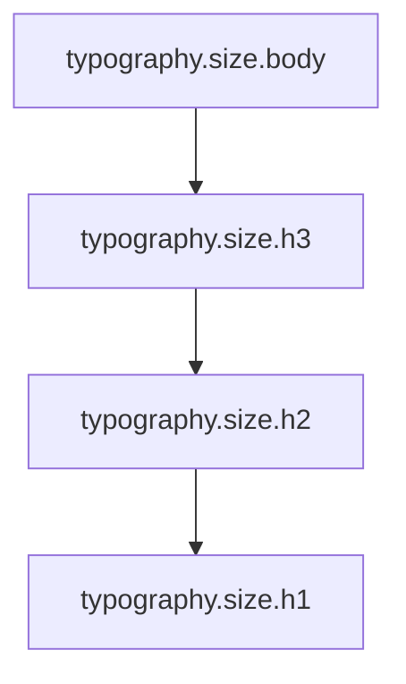
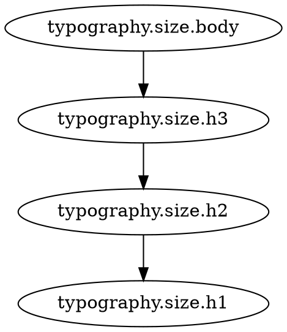

# CLI Reference

Complete reference for all `dcv` commands and options.

## Global Options

These options work with all commands:

```bash
--tokens <path>        # Path to tokens file (default: tokens/tokens.example.json)
--config <path>        # Path to config file (default: dcv.config.json)
--quiet               # Minimal output
--breakpoint <bp>     # Validate specific breakpoint (sm|md|lg)
--all-breakpoints     # Validate all breakpoints
--help, -h            # Show help
--version             # Show version
```

---

## Commands

### `dcv validate`

Validate design tokens against constraints.

```bash
dcv validate [options]
```

**Options:**

```bash
--fail-on <level>         # When to exit with error code
                          # error (default) | warn | off

--summary <format>        # Validation summary output format
                          # none (default) | table | json

--format <output>         # Overall output format
                          # text (default) | json

--output <path>           # Write JSON output to file
--receipt <path>          # Write full validation receipt (audit trail)
--theme <name>            # Apply named theme tokens (tokens/themes/<name>.json)
--perf                    # Show performance metrics

--budget-total-ms <n>     # Maximum total validation time (ms)
--budget-per-bp-ms <n>    # Maximum time per breakpoint (ms)
```

**Examples:**

```bash
# Basic validation
dcv validate

# Validate specific file
dcv validate --tokens design-tokens.json

# Validate specific breakpoint
dcv validate --breakpoint md

# Validate all breakpoints
dcv validate --all-breakpoints

# Validate with a named theme overlay
dcv validate --theme dark

# JSON summary for CI/CD logs
dcv validate --summary table

# Machine-readable JSON output
dcv validate --format json

# Never fail (reporting only)
dcv validate --fail-on off

# Show performance
dcv validate --perf

# Performance budget
dcv validate --budget-total-ms 5000
```

**Exit Codes:**

- `0` - No violations (or `--fail-on off`)
- `1` - Violations found (errors or warnings depending on `--fail-on`)

> **💡 CI/CD Tip:** Use `--fail-on off` when you want validation to run without blocking builds. This is useful for demonstrating the tool works (like in our own CI) or for informational-only reporting. The validation errors will still be logged, but the command exits with code 0.

**Output Formats:**

**Table (default):**
```
validate: 2 error(s), 1 warning(s)

ERROR monotonic  typography.size.h2
  typography.size.h1 >= typography.size.h2 violated: 32px < 40px
  Defined in: themes/typography.order.json

WARN threshold  control.size.min
  Touch target should be >= 44px, got 30px
```

**JSON:**
```json
{
  "ok": false,
  "violations": [
    {
      "severity": "error",
      "kind": "monotonic",
      "token": "typography.size.h2",
      "message": "typography.size.h1 >= typography.size.h2 violated: 32px < 40px",
      "source": "themes/typography.order.json"
    }
  ],
  "stats": {
    "checked": 42,
    "errors": 2,
    "warnings": 1,
    "durationMs": 123
  }
}
```

---

### `dcv graph`

Generate dependency and constraint graphs.

```bash
dcv graph [options]
```

**Options:**

```bash
--format <fmt>              # Output format
                           # mermaid | dot | json | svg | png

--hasse <domain>           # Generate Hasse diagram for domain
                           # typography | color | spacing | layout

--filter <pattern>         # Filter tokens by pattern (glob)

--filter-prefix <prefix>   # Include only tokens starting with prefix

--exclude-prefix <prefix>  # Exclude tokens starting with prefix

--only-violations          # Show only violated constraints

--highlight-violations     # Highlight violations in graph

--violation-color <color>  # Color for violations (hex)

--label-violations         # Add violation labels to graph

--label-truncate <n>       # Truncate labels to n chars

--min-severity <level>     # Minimum severity to show (warn|error)

--focus <token>            # Focus on token and neighbors

--radius <n>               # Depth of neighbors to include (default: 1)

--image-from <tool>        # Image generation tool (mermaid|dot)
```

**Examples:**

```bash
# Generate Mermaid graph
dcv graph --format mermaid > graph.mmd

# Typography hierarchy Hasse diagram
dcv graph --hasse typography --format mermaid > typography.mmd

# Show only violations
dcv graph --only-violations --format mermaid

# Highlight violations
dcv graph --highlight-violations --format mermaid

# Color palette graph
dcv graph --filter-prefix "color.palette" --format mermaid

# Focus on specific token
dcv graph --focus typography.size.h1 --radius 2 --format mermaid

# Generate PNG (requires @mermaid-js/mermaid-cli)
dcv graph --format mermaid > graph.mmd
mmdc -i graph.mmd -o graph.png

# Graphviz DOT format
dcv graph --format dot > graph.dot
dot -Tpng graph.dot -o graph.png
```

**Output Formats:**

**Mermaid (renders on GitHub):**


**Graphviz DOT:**


**JSON:**
```json
{
  "nodes": [
    { "id": "typography.size.h1", "value": "32px" },
    { "id": "typography.size.h2", "value": "24px" }
  ],
  "edges": [
    { "from": "typography.size.h2", "to": "typography.size.h1", "constraint": "monotonic" }
  ]
}
```

---

### `dcv why`

Explain token provenance - why a token has its value.

```bash
dcv why <tokenId> [options]
```

**Options:**

```bash
--format <fmt>    # Output format: json (default) | table
```

**Examples:**

```bash
# Explain typography.size.h1
dcv why typography.size.h1

# JSON output
dcv why typography.size.h1 --format json

```

**Output:**

**Table:**
```
Token: typography.size.h1
Value: 32px
Source: tokens.json

Dependencies:
  typography.size.h2 (24px) - Must be >= this value
  typography.size.h3 (20px) - Indirectly via h2

Constraints (example only):
  ✓ typography.size.h1 >= typography.size.h2 (32px >= 24px)
  ✓ Contrast with color.text.heading (7.2:1 > 4.5:1)
```

**JSON:**

When `--format json` is used, `dcv why` outputs a `WhyReport` object of the form:

```json
{
  "id": "typography.size.h1",
  "value": "32px",
  "raw": "{typography.size.h2}",
  "refs": ["typography.size.h2"],
  "provenance": "base",
  "dependsOn": ["typography.size.h2"],
  "dependents": [],
  "chain": ["typography.size.h1", "typography.size.h2", "typography.size.h3"]
}
```

---

### `dcv build`

Build token outputs in various formats.

```bash
dcv build [options]
```

**Options:**

```bash
--format <fmt>        # Output format: css | json | js

--output <path>       # Output file path

--watch              # Watch mode (rebuild on change)

--theme <name>       # Apply named theme

--mapper <path>      # CSS variable mapping manifest

--dry-run            # Print output without writing

--all-formats        # Generate all formats
```

**Examples:**

```bash
# Build CSS
dcv build --format css --output tokens.css

# Build JavaScript
dcv build --format js --output tokens.js

# Build JSON
dcv build --format json --output tokens.json

# Build all formats
dcv build --all-formats

# Watch mode
dcv build --format css --output tokens.css --watch

# Dry run (preview)
dcv build --format css --dry-run

# Apply breakpoint
dcv build --format css --output tokens-md.css --breakpoint md
```

**Output Examples:**

**CSS:**
```css
:root {
  --color-text: #1a1a1a;
  --color-background: #ffffff;
  --typography-size-h1: 32px;
  --typography-size-h2: 24px;
  --typography-size-body: 16px;
}
```

**JavaScript:**
```javascript
// Generated by DCV. Do not edit.
export default {
  "color.text": "#1a1a1a",
  "color.background": "#ffffff",
  "typography.size.h1": "32px",
  "typography.size.h2": "24px",
  "typography.size.body": "16px"
};
```

**JSON:**
```json
{
  "color": {
    "text": "#1a1a1a",
    "background": "#ffffff"
  },
  "typography": {
    "size": {
      "h1": "32px",
      "h2": "24px",
      "body": "16px"
    }
  }
}
```

---

### `dcv set`

Set token values (generates patch).

```bash
dcv set <expressions...> [options]
```

**Options:**

```bash
--output <path>       # Write patch to file
--format <fmt>        # Output format: json (default)
--write              # Apply changes immediately
--dry-run            # Preview changes without writing
--quiet              # Minimal output
```

**Examples:**

```bash
# Set single value
dcv set typography.size.h1=36px

# Set multiple values
dcv set typography.size.h1=36px typography.size.h2=28px

# Set color with OKLCH
dcv set color.brand.primary=oklch(0.65 0.15 280)

# Write to file
dcv set typography.size.h1=36px --output patch.json

# Apply immediately
dcv set typography.size.h1=36px --write

# Dry run (preview)
dcv set typography.size.h1=36px --dry-run
```

**Output (Patch JSON):**
```json
{
  "typography.size.h1": "36px"
}
```

---

### `dcv patch`

Export patch (diff) from overrides.

```bash
dcv patch [options]
```

**Options:**

```bash
--overrides <path>    # Path to overrides JSON
--tokens <path>       # Base tokens file
--output <path>       # Output patch file
--format <fmt>        # Output format: json (default)
```

**Examples:**

```bash
# Generate patch from overrides
dcv patch --overrides tokens/overrides/md.json

# Write to file
dcv patch --overrides tokens/overrides/md.json --output patches/md-patch.json
```

---

### `dcv patch:apply`

Apply patch document to tokens.

```bash
dcv patch:apply <patch> [options]
```

**Options:**

```bash
--tokens <path>       # Base tokens file
--output <path>       # Output file
--dry-run            # Preview without writing
```

**Examples:**

```bash
# Apply patch
dcv patch:apply patches/md-patch.json

# Apply and write to new file
dcv patch:apply patches/md-patch.json --output tokens-md.json

# Preview changes
dcv patch:apply patches/md-patch.json --dry-run
```

---

## Environment Variables

```bash
DCV_DEBUG_SET=1       # Debug mode for set command
NODE_ENV=development  # Development mode (more logging)
```

---

## Configuration Files

See [Configuration](./Configuration.md) for config file options.

---

## CI/CD Integration

### GitHub Actions

```yaml
name: Validate Design Tokens
on: [push, pull_request]

jobs:
  validate:
    runs-on: ubuntu-latest
    steps:
      - uses: actions/checkout@v4
      - uses: actions/setup-node@v4
      - run: npm ci
      - run: npx dcv validate --fail-on warn --summary json
```

### GitLab CI

```yaml
validate-tokens:
  image: node:18
  script:
    - npm ci
    - npx dcv validate --fail-on warn
```

---

## Next Steps

- **[Constraints](./Constraints.md)** - Learn constraint types
- **[Configuration](./Configuration.md)** - Config file options
- **[API](./API.md)** - Programmatic usage
